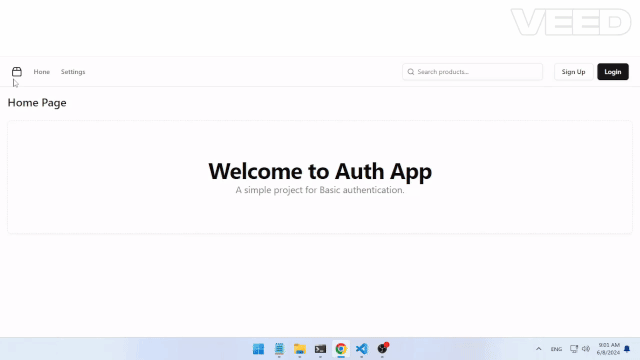

<div >
  <h1 align="center">Auth App</h1>
  <h3 align="center">A simple project for Basic authentication.</h3>
</div>

<div align="center" >
  <h3>Tech Stack</h3>
  <a href=''></a>
  <a href=''></a>
  <a href=''></a>
  <a href=''></a>
  <a href=''></a>
  <a href=''></a>
  <a href=''></a>
  <a href=''></a>
  <a href=''></a>
  <a href=''></a>
  <a href=''></a>
  <a href=''></a>
  <a href=''></a>
  <a href=''></a>
</div>

## Demo

<div align="center" >
  
</div>

## Features

- **Register:** Add a new user.
- **Login** login in existing User.
- **logout:** invalidating user session and remove session cookie
- **Validate requests** check for the session cookie, validate it.

## Learning Objectives

- Understand a basic **Session Authentication**
- **Finish** a small project in **one day**
- Be familiar with **Honojs**, **lucia** and **tanstack query**

## Project Structure

## Instructions

### 1. Clone the repository

```shell
git clone https://github.com/onemahmoudadel/auth-app.git
```

### 2. Install server dependencies

```shell
cd auth-app
npm install
```

### 3. Initialize the database

```shell
npx prisma migrate dev --name init
npx prisma generate
npm run dev
```

### 3. Install frontend dependencies

open new terminal

```shell
cd auth-app/fontend
npm install
```

### 5. Run the dev server

```shell
npm run dev
```

### 6. Open the app in your browser

```
open http://localhost:5173
```
